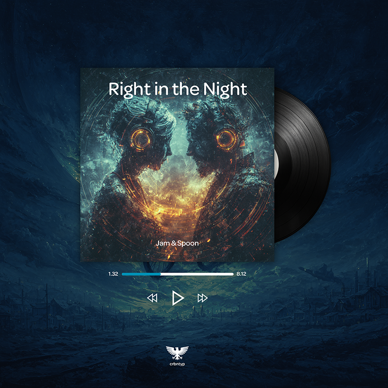

# MP3 Player

A classic MP3 player web application with vinyl record aesthetics and audio visualizer.

### Check it out

[](https://www.instagram.com/p/DP_AT0-Dyol214AZknSKSb_9EnxukBWTg9_kF80/)

## Features

- Audio playback with play/pause, next/previous track controls
- Vinyl record rotation animation
- Real-time audio visualizer
- Dynamic color palettes generated from album artwork
- Responsive design
- Playlist management

## Prerequisites

- Node.js (v14 or higher)
- npm

## Installation

```bash
npm install
```

## Available Scripts

### Development

Start the development server with live reload:

```bash
npm run dev
```

This will:
- Watch for changes in SCSS, HTML, JS, images, music, and data files
- Automatically rebuild on changes
- Start a live server at `http://localhost:8080`

### Building

Build the entire project for production:

```bash
npm run build
```

This runs all build tasks in sequence:
1. Generate color palettes from album artwork
2. Compile SCSS to CSS
3. Copy HTML files
4. Copy JavaScript files
5. Optimize images
6. Convert music files to Opus format
7. Copy data files
8. Copy font files

### Individual Build Tasks

#### Generate Color Palettes
```bash
npm run generate-palettes
```
Generates color palettes from album artwork using the Vibrant library.

#### Build Styles
```bash
npm run build:scss
```
Compiles SCSS files to CSS without source maps.

#### Build HTML
```bash
npm run build:html
```
Copies HTML files from `src/` to `dist/`.

#### Build JavaScript
```bash
npm run build:js
```
Copies JavaScript files from `src/scripts/` to `dist/scripts/`.

#### Build Images
```bash
npm run build:img
```
Optimizes and copies images using Sharp.

#### Build Music
```bash
npm run build:music
```
Converts MP3 files to Opus format for optimal web delivery. Uses FFmpeg to transcode audio files from `src/music/` to `dist/music/` with high-quality Opus encoding (128kbps), providing better compression and smaller file sizes compared to MP3.

#### Build Data
```bash
npm run build:data
```
Copies JSON data files from `src/data/` to `dist/data/`.

#### Build Fonts
```bash
npm run build:fonts
```
Copies Line Awesome icon fonts to `dist/fonts/`.

### Watch Tasks

Watch individual file types for changes:

- `npm run watch:scss` - Watch and compile SCSS files
- `npm run watch:html` - Watch and copy HTML files
- `npm run watch:js` - Watch and copy JavaScript files
- `npm run watch:img` - Watch and copy images
- `npm run watch:music` - Watch and convert music files to Opus format
- `npm run watch:data` - Watch and copy data files

### Serve

Start a local server without watching for changes:

```bash
npm run serve
```

Serves the `dist/` directory at `http://localhost:8080`.

### Clean

Remove the build directory:

```bash
npm run clean
```

## Project Structure

```
player/
├── src/
│   ├── data/           # Track metadata (JSON)
│   ├── img/            # Album artwork and assets
│   ├── music/          # MP3 source files
│   ├── scripts/        # JavaScript files
│   ├── styles/         # SCSS stylesheets
│   └── index.html      # Main HTML file
├── dist/               # Build output (generated)
│   └── music/          # Optimized Opus audio files
├── scripts/            # Build scripts
│   ├── generate-palettes.js
│   ├── optimize-images.js
│   ├── optimize-music.js
│   └── watch-music.js
└── package.json
```

## Technologies Used

- **Sass** - CSS preprocessor
- **Line Awesome** - Icon library
- **Sharp** - Image optimization
- **Node Vibrant** - Color palette extraction
- **FFmpeg** - Audio transcoding and optimization
- **Fluent-FFmpeg** - Node.js wrapper for FFmpeg
- **Chokidar** - File system watcher for development
- **Live Server** - Development server
- **Concurrently** - Run multiple npm scripts simultaneously

## Author

Jonny Pyper / Carbontype

Music copyright belongs to respective owners.

## License

ISC
