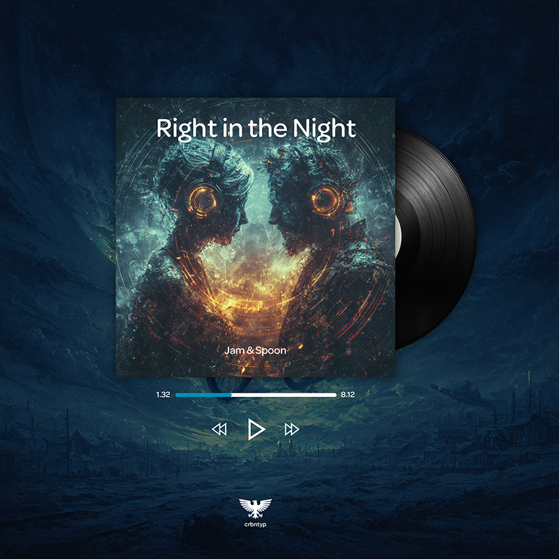

# plyr

A music player with vinyl record aesthetics, audio visualizer, and Google Drive integration.

### Check it out

[](https://www.instagram.com/p/DP_AT0-Dyol214AZknSKSb_9EnxukBWTg9_kF80/)

## Features

- Audio playback with play/pause, next/previous track controls
- Vinyl record rotation animation with sliding effect
- Real-time audio visualizer
- Cover art extracted from the files themselves at build time, with the whole
  UI palette derived from each cover
- **Google Drive integration** - Stream music from Drive folders organized by year/era
- Server-side proxy with caching for Drive files
- Library browser with search, inside the era menu
- Shuffle, repeat (off/all/one), volume, and keyboard shortcuts
- Resumes your last track and position
- Responsive design

## Music Sources

### Local Tracks
Place MP3 files in `src/music/`, then run `npm run generate-palettes` (or any
`npm run build`, which runs it first).

That step reads each file's tags and artwork and writes `src/data/tracks.json`:

- **Artwork** comes from the MP3's embedded picture, resized to a 720px cover
  plus a 240px vinyl-label version in `public/img/covers/` as WebP. Source art
  is often 2048px PNG running several MB — it is never shipped raw.
- **Palette** is extracted from that artwork with node-vibrant and drives the
  CSS custom properties, so the entire UI recolours per track.
- **Audio** is transcoded to Opus by `prebuild:music`. Both steps name their
  output from a shared slug (`scripts/lib/slug.js`), so filenames need no URL
  escaping and the two can't drift apart.

Tracks whose files carry no embedded art fall back to a **sleeve** from the
generated set. To give one real art instead, drop an image at
`src/covers/<slug>.jpg` — it takes precedence over embedded art. See
`src/covers/README.md`.

### Fallback sleeves

The fallback set is purpose-made album art, not stock photography. Masters are
generated once with `gpt-image-2` via the shared Kie CLI and processed into the
shipped set:

```bash
node scripts/generate-sleeves.mjs   # writes masters to _sleeves/ (costs credits)
npm run build-sleeves               # -> public/img/placeholders/ + placeholders.json
```

`_sleeves/` is gitignored; the processed JPEGs and `src/data/placeholders.json`
are committed, so a normal build never needs to regenerate anything. Each
sleeve's palette is extracted the same way covers' are, so a track on a
fallback still recolours the whole UI.

A track picks a sleeve at random on each load, so artless tracks look different
between visits by design.

### Google Drive
Stream from public Google Drive folders. Configured in `src/scripts/drive.js`:

```javascript
this.folders = [
    { id: 'FOLDER_ID', label: '1993-97', years: '1993-97' },
    { id: 'FOLDER_ID', label: '1998', years: '1998' },
    // ...
];
```

**Requirements:**
- Google Cloud project with Drive API enabled
- API key with domain restrictions
- Folders shared as "Anyone with the link"

**File naming:** `Artist - Track Title.mp3` (parsed automatically)

## Prerequisites

- Node.js (v14+)
- npm
- FFmpeg (for audio optimization)

## Installation

```bash
npm install
```

## Development

```bash
npm run dev
```

Serves at `http://localhost:8080` with hot reload. The service worker is
deliberately not registered on localhost so it can't cache the dev bundle.

## Build

```bash
npm run build
```

Runs all tasks: palette generation, SCSS, HTML, JS, images, music optimization, data, fonts.

## Project Structure

```
plyr/
├── src/
│   ├── covers/         # Optional drop-in cover art (overrides embedded)
│   ├── data/           # Track metadata (JSON, generated)
│   ├── music/          # MP3 source files
│   ├── scripts/
│   │   ├── main.js         # Player orchestration
│   │   ├── drive.js        # Google Drive client (talks to proxy.php)
│   │   ├── era-selector.js # Source + track picker popup
│   │   ├── persistence.js  # localStorage state
│   │   ├── hash-router.js  # #source/track deep links
│   │   └── visualizer.js
│   ├── styles/         # SCSS (single stylesheet, tokens at the top)
│   └── index.html
├── dist/               # Build output
│   ├── cache/          # Cached Drive files (server-side)
│   └── music/          # Optimized Opus files
├── public/
│   ├── proxy.php       # Drive caching proxy (server-side)
│   └── sw.js           # PWA service worker
├── _sleeves/           # Generated sleeve masters (gitignored)
├── scripts/            # Build scripts
│   ├── lib/slug.js          # Shared filename slug
│   ├── generate-palettes.js # Art extraction + palettes + tracks.json
│   ├── generate-sleeves.mjs # One-off: generate fallback sleeves (Kie)
│   ├── build-sleeves.js     # Process sleeve masters into the shipped set
│   ├── optimize-images.js
│   ├── optimize-music.js
│   └── deploy.js
└── package.json
```

## Google Drive Proxy

The proxy (`proxy.php`) handles CORS issues and caches Drive files:

- First play: fetches from Drive, caches locally
- Subsequent plays: served from cache
- Auto-cleanup when cache exceeds 2GB
- 30-day cache expiry

Cache location: `/var/www/crbntyp/plyr/cache/`

## Technologies

- Vite + Sass
- Inline SVG icons (no icon font)
- Sharp (image optimization)
- Node Vibrant (color extraction)
- FFmpeg (audio transcoding to Opus)
- music-metadata (tag + embedded artwork reading)

## Author

Jonny Pyper / Carbontype

Music copyright belongs to respective owners.

## License

ISC
